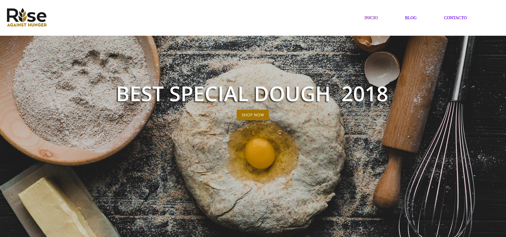
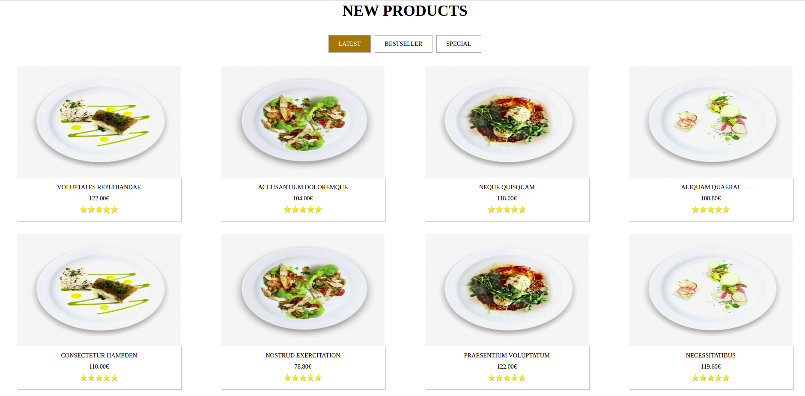
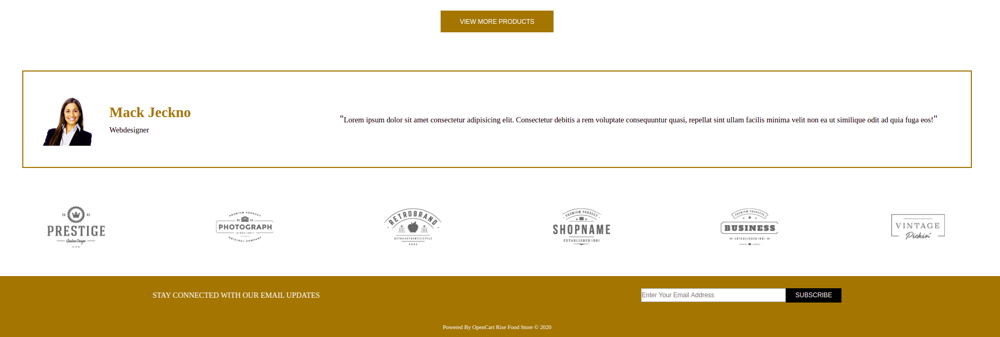
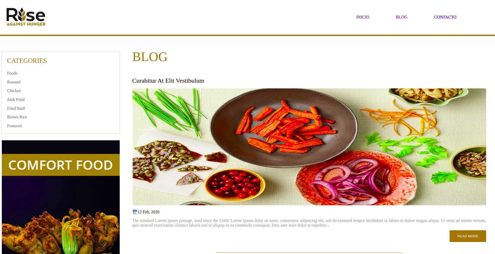
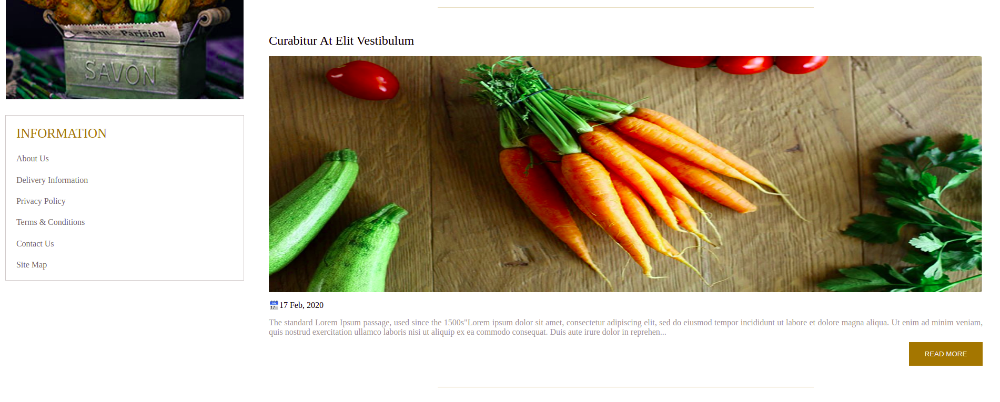
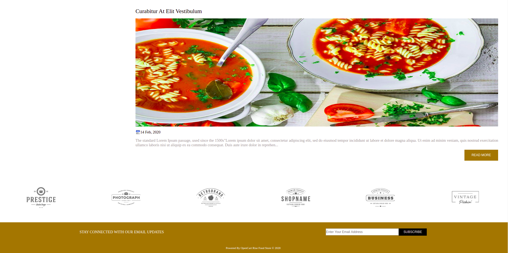

# GeeksHubs-P1-Restaurante

_Web de un restaurante donde se pueden ver los diferentes productos que ofrece, también dispone de un blog y un formulario de contacto.

Este proyecto es una práctica de maquetación con HTML5, CSS3, FlexBox._

## Comenzando 🚀

_Para obtener una copia del proyecto en funcionamiento en tu máquina local para propósitos de desarrollo y pruebas, necesitaras descargarlo o clonar el repositorio a tu máquina._

### Tecnologías🛠️

Programas y Frameworks utilizados para el desarrollo y pruebas del proyecto:

* [VSCode] - Editor de código usado - (https://code.visualstudio.com/).
* [Flex-Box]
* [Bootstrap] - Es un frameword de diseño;
* [GitHub] - Control de versiones.

### Instalación 🔧

No requiere instalación, bastara con ejecutar el archivo index.html.

Las instrucciones sobre cómo usarlas en su propia aplicación están vinculadas a continuación.
GitHub  [plugins/github/README.md][PlGh] 

## Video
(https://www.youtube.com/watch?v=s43J_CqBp7E)

## Imagenes

## Wiki 📖

Puedes encontrar mucho más de cómo utilizar este proyecto en nuestra [Wiki](https://github.com/jocamo00/GeeksHubsP1-Restaurante)

## Versionado 📌

Usamos [GitHub](https://github.com/) para el versionado. Para todas las versiones disponibles, mira los [tags en este repositorio](https://github.com/jocamo00/GeeksHubsP1-Restaurante).

## Autor ✒️

* **Jose Carreres** - [jocamo00](https://github.com/jocamo00)

